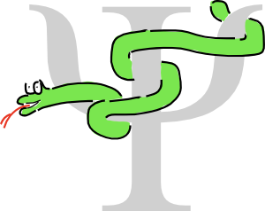

### cclib

cclib is a Python library that provides parsers for output files of computational chemistry packages. It also provides a platform for computational chemists to implement algorithms in a platform-independent way.

For more information, go to [https://cclib.github.io](https://cclib.github.io). There is a mailing list for questions at cclib-users@lists.sourceforge.net.
